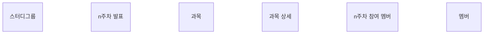
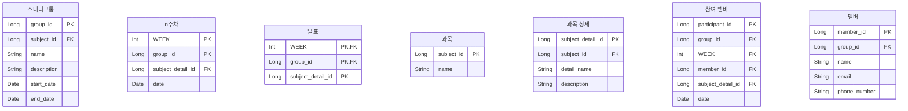
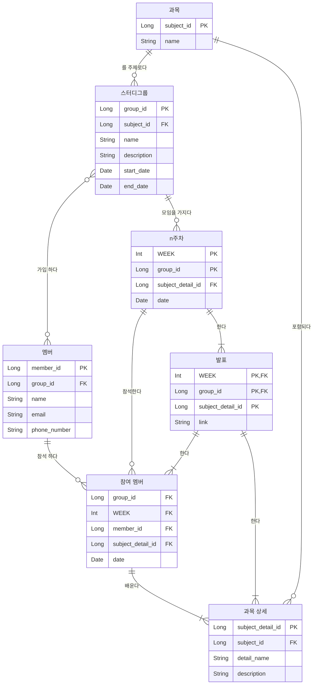

# 2회차 과제 - DB 기초(데이터 모델링의 이해)

<aside>
💡 SQLD 데이터 모델링의 이해
[https://dataonair.or.kr/db-tech-reference/d-guide/sql](https://dataonair.or.kr/db-tech-reference/d-guide/sql/)
[ERD 모델링 예시](https://mermaid.live/edit#pako:eNqlVcFq20AQ_ZVlz84P-JwUQnow5NCLwGysiaPWWpn16hBkQ0rVS3JoCzENxQktcYkTchBtIQ74i7yrf-iuI8uSVrJdKl2keTOr90ZvZwPc8mzAdQxs1yFtRlyLInVZWJ6P4zASl5fzp6m4fbYwGng7O16gIHE_Fr9CFamrl3l0Jm8-onh4JS7GFq4u7_eTcipvZzKaJPXiYSJvQnkdIr3S3dmGVYIXSF-vPdpGbeb53aZjo8ZBAen5R2-hxTX2KoMdcuYolBIXjKANvRZzutzx6ArbJRxQjxPGm7Z6LABA7Ux4YNEl9ZXKVLiMpvLrI8q1T8fC63g4yunOF_cXTY9G8ZdRUlWdn-nPPuXozd7egdmazU2zgROnU-zdQnGp2pRdyrdM7Iq2xdVdUjX_PRMP90h-eC_DaYXYZVW51FqOcVFuCWpKbph26Tj0nSH6hWzuDxt-XVj85wzpH_R9JH7kpSxXCKq921jn3bVkSnv56TEeTsTnqxIaaWbwTx3aYrMlhdvtuYymoofW2kREkfz2Jz8-CvWVwyPLOfWS4RQX3CNgxfz_2zdZaRuGhDFjK3WtiFZv_W1nIrhKkBHtnngUmtTX30lE4Rp2galsWx0nC0YW5ieglsRagw3HxO9wzV6nEp97h6e0heuc-VDDflf3JzmDcP2YdHow-Av3P4B8) → 설명 중 변경 할 수 있음

+ 1주차 질문 추가
[https://endoflife.date/spring-boot](https://endoflife.date/spring-boot)

</aside>

# 데이터 모델링

---

%2054cb329aeaf5443487346729a9eb06e1/Untitled.png)

- **정의**
    
    “사람이 살아가면서 나타날 수 있는 다양한 현상은 
    사람, 사물, 개념 등에 의해 발생된다고 할 수 있음”
    
    “모델링은 이것을 표기법에 의해 규칙을 가지고 표기하는 것 자체”
    
    %2054cb329aeaf5443487346729a9eb06e1/Untitled%201.png)
    
    - Webster 사전 
    ”가설적 또는 일정 양식에 맞춘 표현”
    ”어떤 것에 대한 예비표현으로 그로부터 최종대상이 구축되도록 하는 계획으로서 기여하는 것”
    - 복잡한 ‘**현실세계**’를 **단순화**
    - **사물** 또는 **사건**에 관한 **양상**이나 **관점**을 연관된 **사람**이나 **그룹**을 위하여 명확하게 하는
    - 현실 세계의 추상화된 반영
        
        %2054cb329aeaf5443487346729a9eb06e1/Untitled%202.png)
        
- **특징**
    - **추상화** →일정한 양식(표기법)
    - **단순화 →** 현실세계를 ****규약에 의해 제한된 표기법이나 언어로 표현하여 쉽게 이해할 수 있는 개념
    - **명확화** → 이해하기 쉽게 애매호모함을 제거하고 **정확**하게 **현상을 기술**
- **관점**
    - **데이터 관점** → **업무**가 어떤 **데이터**와 **관련**이 있는지
    **데이터간**의 **관계** 에 대해 **모델링** 하는 방법 (**What**)
    - **프로세스 관점 →** 업무가 **실제 하는 일**은 무엇인지, 무엇을 해야되는지 (**How**)
    - **상관 관점** → 업무가 처리하는 **일의 방법에 따라** 
    **데이터**는 어떻게 **영향을 받고 있는지**에 대한 방법 (**Interaction**)
    
    %2054cb329aeaf5443487346729a9eb06e1/Untitled%203.png)
    
- **기능**
    
    가시화, 명세화, 구조화, 문서화, 다양한 관점제공, 표현 방법
    
- **중요성**
    - **파급효과**
    
    [좋코딩 몰아보기 【시즌1】](https://youtu.be/k1LFrntx6UM?t=2203)
    
    - **간결한 표현 (**관계자들의 **이해와** 데이터 **정합성)**
    - **데이터 품질** (치유가 어려움)
        - 중복, 비 유연성, 비 일관성
- **모델링 순서**
    
    **개념** → **논리** → **물리**
    
    추상 → 구체
    
    %2054cb329aeaf5443487346729a9eb06e1/Untitled%204.png)
    
    **개념** → 요구사항에 대한 **관계 발견** 및 전사적 **모델링**
    
    **논리 → 스키마 설계 + ERD(**누가 어떻게) 정규화 + 관계 + 규칙
    
    **물리** → 어떻게 저장될 것인가 / 저장구조, 장치, 추출 방법
    

# 엔티티

---

- **≒ 객체, 실체**
    
    %2054cb329aeaf5443487346729a9eb06e1/image.jpg)
    
    - “**변별**할 수 있는 **사물”** - *Peter Chen (1976)*
    - “데이터베이스 내에서 **변별** 가능한 **객체”** - *C.J Date (1986)*
    - “정보를 **저장**할 수 있는 **어떤 것”** - *James Martin (1989)*
    - “정보가 저장될 수 있는 **사람**, **장소**, **물건**, **사건** 그리고 **개념** 등” - *Thomas Bruce (1992)*
    
    결론적으로
    
    엔티티 = “업무에 필요하고 유용한 정보를 저장하고 관리하기 위한 집합적인 것(Thing)”
    
    **→ 사람, 장소, 물건, 사건, 개념 (명사)**
    
    **→** 업무상 관리가 필요한 **관심사**
    
    → 저장이 되기위한 어떤 것
    
    |  | 엔터티 |
    | --- | --- |
    | 사람 | 스터디 원 |
    | 장소 | 스터디 룸 |
    | 물건 | 금액 |
    | 사건 | 스터디 |
    | 개념 | 과목 |
    
- **인스턴스**
    
    
    |  | 엔터티 | 인스턴스 |
    | --- | --- | --- |
    | 사람 | 스터디 원 | 김용연, 이지우, 최정혜, 하민주, 홍기현, 이충호 |
    | 장소 | 스터디 룸 | 캄앤심플, 히든스페이스, 두잇 스페이스 |
    | 물건 | 금액 | 3600원, 5200원 |
    | 사건 | 스터디 | 1주차, 2주차, 발표 |
    | 개념 | 과목  | 백엔드, DB |
    
    %2054cb329aeaf5443487346729a9eb06e1/Untitled%205.png)
    
- **특징**
    - 반드시 해당 업무에서 **필요하고 관리**하고자 하는 **정보**이어야 한다
        
        %2054cb329aeaf5443487346729a9eb06e1/Untitled%206.png)
        
    - **유일한** 식별자에 의해 **식별**이 가능해야 한다.
        
        %2054cb329aeaf5443487346729a9eb06e1/Untitled%207.png)
        
    - **영속적**으로 존재하는 **인스턴스의 집합**이어야 한다.(‘한 개’가 아니라 ‘두 개 이상’)
        
        %2054cb329aeaf5443487346729a9eb06e1/Untitled%208.png)
        
    - 업무 프로세스에 의해 **이용**되어야 한다.
        
        %2054cb329aeaf5443487346729a9eb06e1/Untitled%209.png)
        
    - 반드시 **속성**이 있어야 한다.
        
        %2054cb329aeaf5443487346729a9eb06e1/Untitled%2010.png)
        
    - 다른 엔터티와 최소 한 개 이상의 **관계**가 있어야 한다.
        
        %2054cb329aeaf5443487346729a9eb06e1/Untitled%2011.png)
        
    
- **분류**
    
    %2054cb329aeaf5443487346729a9eb06e1/Untitled%2012.png)
    
    ****유/무형에 따른 분류****
    
    ****발생시점에 따른 분류****
    
- **명명**
    - 현업 용어
    - Full name(가능한)
    - 단수 + 명사
    - 유일한 이름
    - 생성 의미대로 이름을 부여 ⇒ (~~Customer_Product~~) 고객 `의` 제품, 고객 `이 주문한` 제품

# 속성

---

- **개념**
    
    “**업무에서 필요**로 하는 인스턴스로 관리하고자 하는(+ 엔티티를 설명, 인스턴스 구성요소) 
    **의미상 더 이상 분리**되지 않는 **최소의 데이터 단위**” 
    
    %2054cb329aeaf5443487346729a9eb06e1/Untitled%2013.png)
    
- **표기법**
    
    ****관계**** 
    
    - 한 개의 **엔터티**는 두 개 이상의 **인스턴스의 집합**이어야 한다.
    - 한 개의 **엔터티**는 두 개 이상의 **속성**을 갖는다.
    - 한 개의 **속성**은 한 개의 **속성값**을 갖는다.
    
    %2054cb329aeaf5443487346729a9eb06e1/Untitled%2014.png)
    
    %2054cb329aeaf5443487346729a9eb06e1/Untitled%2015.png)
    
- **특징**
    - 해당 업무에서 **필요**하고 **관리**하고자 하는 정보
    - 정규화 이론에 근간하여 정해진 주식별자에 **함수적 종속성**을 가져야한다
    - **하나의 속성**에는 **한 개의 값**만을 가진다. 
    다중값일 경우 별도의 엔터티를 이용하여 분리한다.
- **분류**
    
    **속성에 따라**
    
    - **기본속성** → 업무분석을 통해 **바로 정의**한 속성
    - **설계속성** → 무상 존재하지는 않지만 **설계를 하면서 도출**해내는 속성
    - **파생속성** → 계산이나 **변형이 되어 생성**되는 속성
    
    %2054cb329aeaf5443487346729a9eb06e1/Untitled%2016.png)
    
    ****구성방식에 따라****
    
    **식별** → PK
    
    **관계** → FK
    
    **나머지 →** 일반
    
    **속성을 쪼갤 수 있는지** → 단순형 / 복합형(주소)
    
    **동일한 성질을 가지고 있는지** → 단순 / 다중
    
    %2054cb329aeaf5443487346729a9eb06e1/Untitled%2017.png)
    
- **도메인**
    
    ‘속성을 가질 수 있는 값의 범위’ = 데이터 타입 / 제약사항
    
- **명명**
    
    유일하지 않을 시 → 반정규화가 힘듬
    
    %2054cb329aeaf5443487346729a9eb06e1/Untitled%2018.png)
    

# 관계

---

- **개념**
    
    “엔터티의 인스턴스 사이의 논리적인 연관성으로서 
    존재의 형태로서나 행위로서 서로에게 연관성이 부여된 상태”
    
    %2054cb329aeaf5443487346729a9eb06e1/Untitled%2019.png)
    
- **페어링(관계를 가지는 것)**
    
    관련된 인스턴스들과 관계의 어커런스로 참여하는 형태를 관계
    
    %2054cb329aeaf5443487346729a9eb06e1/Untitled%2020.png)
    
- **분류**
    
    **UML**의 연관관계와 의존관계
    
    %2054cb329aeaf5443487346729a9eb06e1/Untitled%2021.png)
    
- **표기법**
    - ****관계명 →**** 시작점 / 끝점, 능동적 / 수종적
        
        %2054cb329aeaf5443487346729a9eb06e1/Untitled%2022.png)
        
    - **관계 차수 → 1:M 1:1 M:N**
- **선택사항**
    
    필수 / 선택
    
    %2054cb329aeaf5443487346729a9eb06e1/Untitled%2023.png)
    
- **정의 및 읽는 방법**
    
    **정의 →** 연관 규칙, 정보의 조합, 규칙 서술, 동사
    
    **읽기**
    
    %2054cb329aeaf5443487346729a9eb06e1/Untitled%2024.png)
    

# 식별자

---

- **개념**
    
    “하나의 엔터티에 구성되어 있는 
    
    여러 개의 속성 중에 엔터티를 대표할 수 있는 속성”
    
    %2054cb329aeaf5443487346729a9eb06e1/Untitled%2025.png)
    
- **특징**
    
    주식별자(PK) → 유일, 최소, 불변, 존재
    
    외부 식별자(FK) → 참조 무결성
    
- **분류 및 표기법**
    
    %2054cb329aeaf5443487346729a9eb06e1/Untitled%2026.png)
    
    스스로 생성여부 → ~~보조식별자~~ 외부식별자
    
- **도출 기준**
    
    이름으로 기술 X, 속성 수 많아지지 않도록 
    
    업무에서 많이 사용
    
    %2054cb329aeaf5443487346729a9eb06e1/Untitled%2027.png)
    
- ****식별자관계****와 ****비식별자관계****에 따른 식별자
    - 외부식별자(FK) 를 식별자로?
        
        %2054cb329aeaf5443487346729a9eb06e1/Untitled%2028.png)
        
    - 관계는 어떻게 할건데
    (부모의 주식별자가 상속이 되는 경우 ⇒ **식별자관계**)
        
        %2054cb329aeaf5443487346729a9eb06e1/Untitled%2029.png)
        
    - 관계만 받고 **속성만 사용**할 경우
    → 필수 X, 생명주기가 다른경우, 각각의 엔터티가 별도의 관계를 가질 경우 ⇒ **비식별자관계**
        
        %2054cb329aeaf5443487346729a9eb06e1/Untitled%2030.png)
        
    

